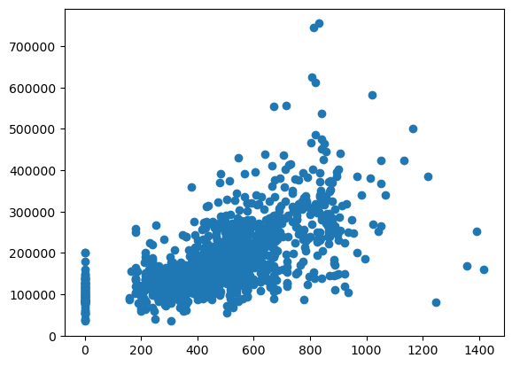
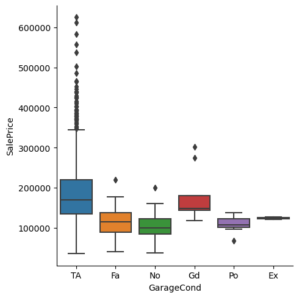
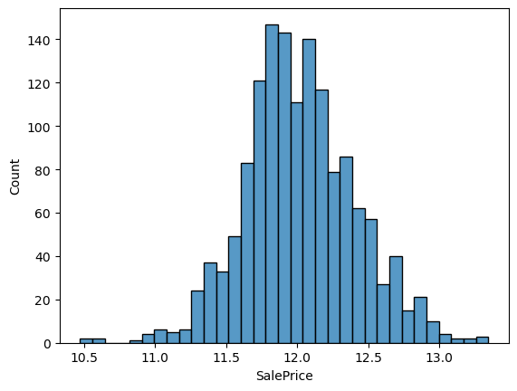
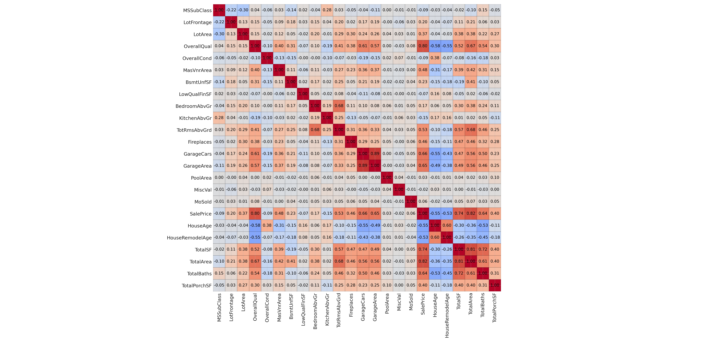

# 🏠 House Prices Prediction — Regression Project

A complete end-to-end machine learning workflow applied to the **Kaggle House Prices** dataset.  
This project includes EDA, preprocessing, baseline models, stacking, and a final Kaggle-ready submission.

---

## 📊 Exploratory Data Analysis (EDA)

### Scatter Plot Example


### Box Plot Example


### Histogram Example


### Correlation Heatmap


---

## 🧼 Data Cleaning & Preprocessing

- Removal of extreme outliers
- Cleaning of missing values
- Feature dropping based on correlation and redundancy
- Feature engineering (`TotalSF`, `TotalBath`, `HouseAge`, etc.)

Preprocessing is handled using **ColumnTransformer** with:
- StandardScaler for numerical features
- OneHotEncoder for categorical features

---

## 🤖 Models Implemented

- **Ridge Regression**
- **RandomForestRegressor**
- **XGBoostRegressor**
- **LightGBM**
- **CatBoost**

All models wrapped in:
```
TransformedTargetRegressor(func=log1p, inverse_func=expm1)
```

---

## 🏆 Stacked Ensemble

A stacking regressor combining:

- Ridge  
- RandomForest  
- XGBoost
- LightGBM
- CatBoost

with **Ridge** as the meta-learner.

---

## 🧪 Model Evaluation

Evaluation performed using **5-fold cross-validation** with **RMSE**.

---

## 📤 Final Submission

Final Kaggle-ready predictions saved as:

```
submission.csv
```

---

## 📁 Project Structure

```
📦 House-Price-Prediction/
├── house_price_prediction.ipynb
├── train.csv
├── test.csv
├── submission.csv
├── GarageArea.png
├── GarageCond.png
├── heatmap.png
├── SalePriceHist2.png
└── README.md
```

---

## 📚 What I Learned

- How to conduct structured EDA  
- Detect and handle outliers  
- Build preprocessing pipelines  
- Compare regression models  
- Use stacking to improve predictions  
- Build a complete ML pipeline from data to submission  

---

## 🚀 Future Improvements

- Hyperparameter tuning (Optuna)
- Advanced stacking/blending
- SHAP interpretability
- Feature engineering expansion

---

## 🗺️ Project Setup Diagram

```mermaid
flowchart TD

    A[📥 Raw Data<br>(train.csv & test.csv)] --> B[🔎 EDA<br>Scatter · Hist · Box · Heatmap]
    B --> C[🧼 Data Cleaning<br>Outliers · Missing · Drops]
    C --> D[🧩 Feature Engineering<br>TotalSF · TotalBath · HouseAge]
    D --> E[⚙️ Preprocessing Pipeline<br>Numeric + Categorical]
    E --> F[🤖 Baseline Models<br>Ridge · RF · XGBoost]
    F --> G[🧱 Stacking Ensemble<br>Meta: Ridge]
    G --> H[📤 Predictions<br>submission.csv]

    style A fill:#dae8fc,stroke:#6c8ebf
    style B fill:#ffe6cc,stroke:#d79b00
    style C fill:#f8cecc,stroke:#b85450
    style D fill:#e1d5e7,stroke:#9673a6
    style E fill:#d5e8d4,stroke:#82b366
    style F fill:#fff2cc,stroke:#d6b656
    style G fill:#f5f5f5,stroke:#999999
    style H fill:#cfe2f3,stroke:#6fa8dc
```

---

## ▶️ How to Run This Project

### **1. Install dependencies**
```bash
pip install -r requirements.txt
```

### **2. Open the notebook**
```bash
jupyter notebook house_price_prediction.ipynb
```

### **3. Run all cells**
Make sure `train.csv` and `test.csv` are in the same directory as the notebook.

### **4. Generate final predictions**
The notebook will automatically create:
```
submission.csv
```
You can upload this file to Kaggle for scoring.

---

## 🚀 Future Improvements

- Hyperparameter tuning with Optuna  
- GitHub Actions for notebook execution & HTML export  
- SHAP interpretability

---

## 📬 Contact
If you'd like to discuss the project, collaborate, or see more of my work:

**Author:** Mateus Vieira Vasconcelos  
**GitHub:** https://github.com/ludoteca12
